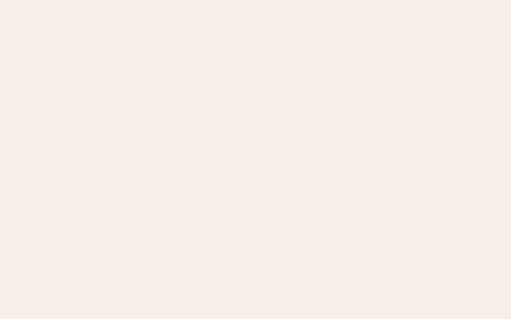
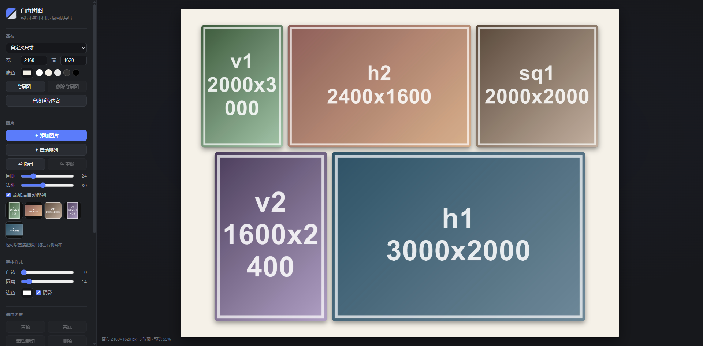

# 自由拼图 · Photo Collage

一个给摄影师用的**纯前端照片拼图工具**——横图竖图混着拼、自由排版、原画质导出。零依赖、零上传，照片全程不离开你的电脑。

A zero-dependency, browser-only photo collage tool for photographers. Mix landscape & portrait shots freely, arrange, and export at full quality — nothing ever leaves your machine.

**🔗 在线体验 / Live demo: <https://lysyminger.github.io/photo-collage/>**





## 使用

不需要安装任何东西：

1. 下载本仓库（Code → Download ZIP，或 `git clone`）
2. 双击打开 `index.html`（推荐 Chrome / Edge）
3. 把照片拖进画布，开始拼

## 功能

**排版**
- 横竖混排自由拖拽，智能吸附（画布边缘/中线/相邻图片/等间距）
- 一键「自动排列」：杂志式等高行布局，逐行居中，间距、边距分开可调
- 画布尺寸自定义 + 常用预设（小红书 3:4、方形、9:16、A4 等），高度可一键适应内容

**编辑**
- 拖**角**等比缩放，拖**边**裁切构图（不变形）
- 双击照片铺满当前框，`Alt+拖` 在框内移动画面调构图
- `Ctrl+点` 多选、空白处拖拽框选（`Shift` 追加）、多张一起移动
- 完整撤销/重做（`Ctrl+Z` / `Ctrl+Y`，50 步）

**样式**
- 整体：白边、圆角、阴影、底色色板
- 逐图层覆写：单独圆角、透明度、**倒影**
- 背景图：任意图片铺满 + 毛玻璃模糊

**导出**
- JPG / PNG，1x–3x 分辨率，永远用原图绘制（预览用降采样位图，导出不降质）

**移动端**
- 手机/平板自适应布局（画布在上、控件在下），触屏加大点按目标
- 触屏没有 Alt 键，用「框内构图模式」开关代替 Alt+拖 调整框内画面

## 快捷键

| 按键 | 作用 |
|------|------|
| `Ctrl+Z` / `Ctrl+Y` | 撤销 / 重做 |
| `Ctrl+A` | 全选 |
| `Ctrl+点击` | 多选 |
| `Tab` / `Shift+Tab` | 切换图层 |
| 方向键（`Shift` 加速） | 微调位置 |
| `Delete` | 删除选中 |
| `Esc` | 取消选择 |

## 技术说明

纯 HTML + CSS + 原生 JavaScript（Canvas 2D），无任何构建工具和第三方库。刻意不用 ES Modules，保证 `file://` 双击直开可用。

```
├── index.html          页面结构
├── css/style.css       样式（设计变量集中在 :root）
└── js/
    ├── core.js         状态、多选集、撤销/重做
    ├── render.js       画布绘制（背景/图层/倒影/缩略图）
    ├── interact.js     指针与键盘交互、吸附、裁切
    └── ui.js           侧栏控件、导入、自动排列、导出
```

已知限制：HEIC / RAW 浏览器不解码，需先转 JPG；刷新页面会丢失当前排版（布局保存在计划中）。

## License

[MIT](LICENSE)
